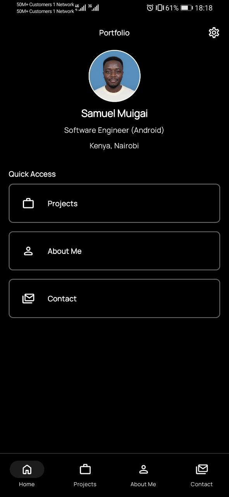
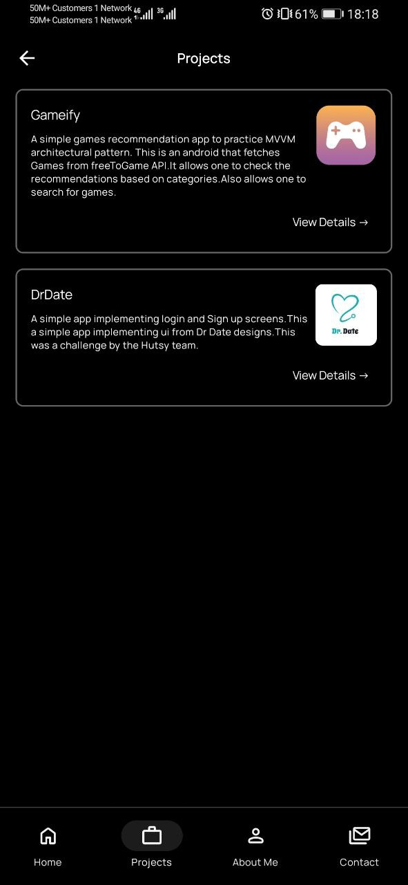
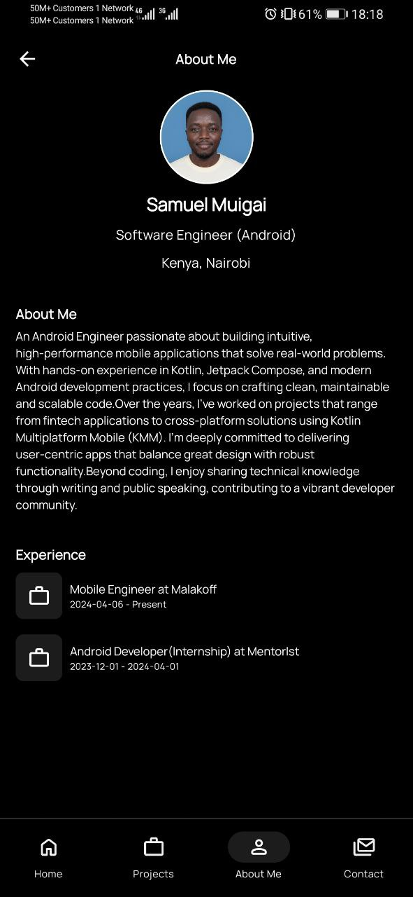
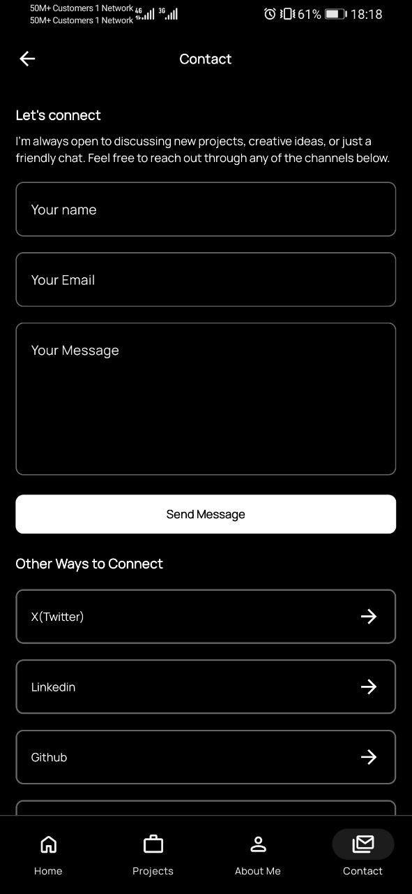

# Portfolio Android App

A modern Android portfolio application built with Jetpack Compose and clean architecture principles. This is the frontend of the backend I worked on in effort to experiment Kotlin on the server side. You can check the backend repo here 👉🏽 [Portfolio Backend](https://github.com/Sam-muigai/Portfolio-Backend)

The design of this application were made by [Stitch](https://stitch.withgoogle.com/).

## Screenshots
<table>
  <tr>
    <th>Home Screen</th>
    <th>Projects Screen</th>
    <th>About Me Screen</th>
  </tr>
  <tr>
    <td></td>
    <td></td>
    <td></td>
  </tr>
  <tr>
    <th>Contact Screen</th>
  </tr>
  <tr>
    <td></td>
  </tr>
</table>


## Architecture

The project follows clean architecture principles with a modular structure:

```
├── app/                   # Main application module
├── core/                  # Core shared modules
│   ├── network/           # Network utilities and configuration
│   └── theme/             # UI theme and design system
├── data/                  # Data layer implementation
├── domain/                # Business logic and use cases
├── features/              # Feature modules
│   ├── home/              # Home screen feature
│   ├── projects/          # Projects showcase feature
│   ├── about/             # About section feature
│   └── contact/           # Contact information feature
└── build-logic/           # Build configuration and conventions
```


## Tech Stack

- **Language**: Kotlin
- **UI Framework**: Jetpack Compose
- **Architecture**: Clean Architecture with MVVM
- **Dependency Injection**: Koin
- **Navigation**: Navigation Compose
- **Build System**: Gradle with Kotlin DSL
- **Networking**: Custom network module


